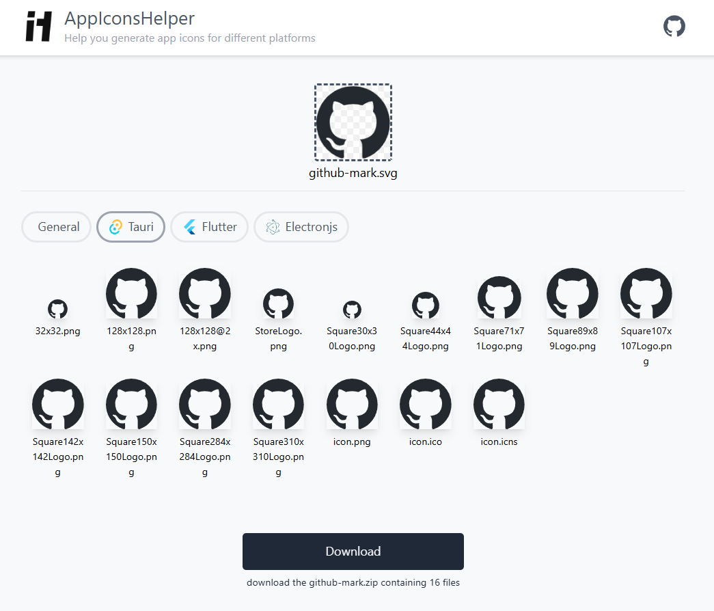

# AppIconsHelper

Generate app icons for different platforms.

## Screenshots

<div align="center">
	
</div>

## Features

- Support generate ico and icns files online
- Directly generate icon files needed for `Flutter` and `Tauri`

## Development

modify the file `png2icons/lib/UPNG.js` in `node_modules`

```js
;(function(){
	var UPNG = {};
	var UZIP; // <-- adding this line
```

## Thanks to

- https://github.com/idesis-gmbh/png2icons
- https://github.com/feross/buffer
